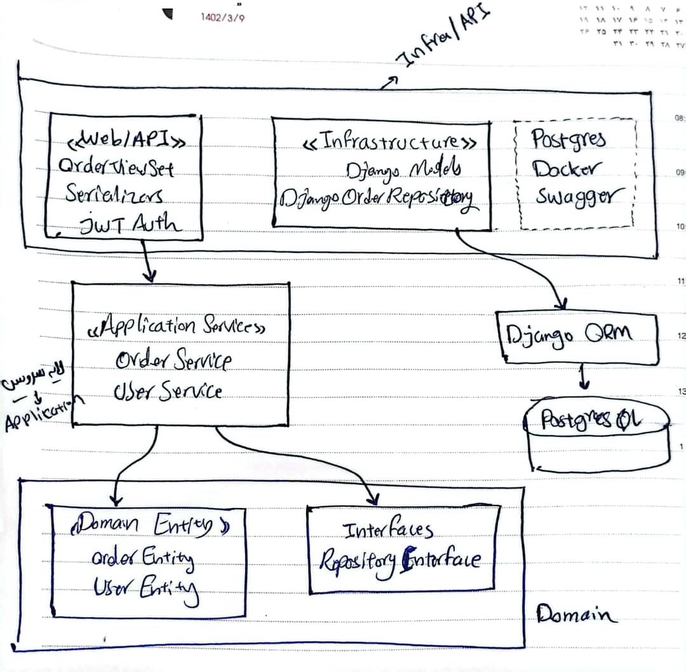
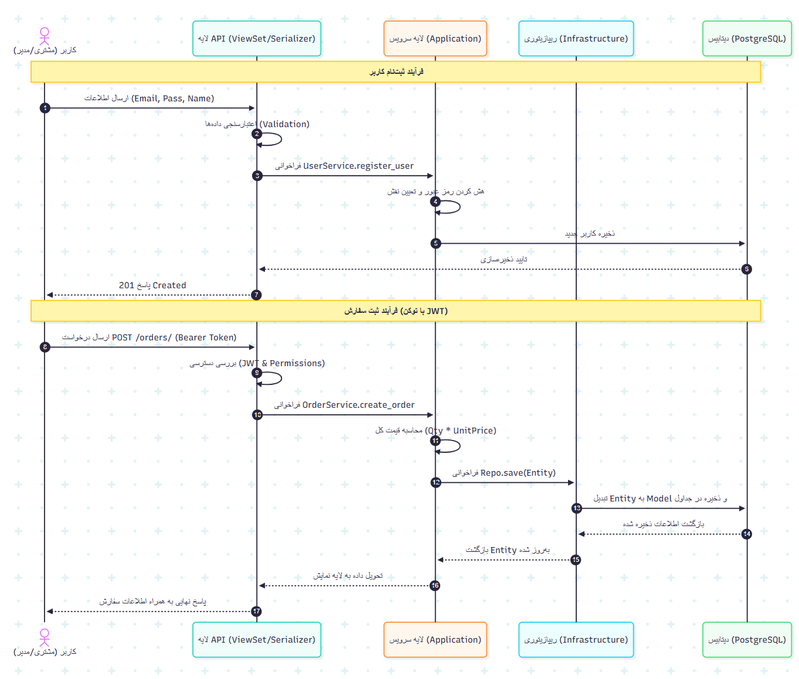
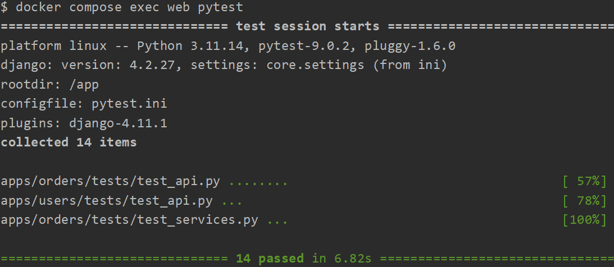

# CC-Eyar



تحلیل دستی ساختار لایه‌ها قبل از پیاده‌سازی رو اینطوری انجام دادم.

## دلیل پیاده سازی این معماری

دلیل اصلی جداسازی لایه سرویس و استفاده از Repository Pattern، استقلال کامل منطق بیزنس از ابزارها هست. مثلا در این پیاده سازی دیگه وابسته به ORM جنگو نیستیم. به طور مثال فقط کافی هست که پیاده سازی جدیدی از OrderRepositoryInterface با ابزار دیگه مثل SQLAlchemy اینجکت کنیم بدون اینکه حتی یک خط کد از  هسته مرکزی برنامه مون دستخوش تغییر بشه .
و همینطور نگهداری کد هم راحت میشه و منطق و بیزنس کد رو از viewها جدا کردم که تست پذیری کد رو هم بالاتر میبره. 

## Sequence Diagram

در نمودار زیر، فرآیند ثبت‌نام کاربر و ثبت سفارش رو ترسیم کردم. پیاده‌سازی کد دقیقاً مطابق با منطق این دیاگرام انجام شده تا تفکیک مسئولیت‌ها رعایت بشه.



> برای پروژه‌های کوچیک معمولاً از همون ساختار استاندارد و پیش‌فرض جنگو استفاده می‌کنم چون سرعت توسعه رو بالا می‌بره. اما در این پروژه، چون هدف ارزیابی دانش فنی و توانایی طراحی سیستم بود، از Clean Architecture استفاده کردم. این ساختار تضمین می‌کنه که کد ما در ابعاد بزرگ، کاملاً Maintainable (قابل نگهداری) و Scalable (توسعه‌پذیر) باقی بمونه.

---

## قابلیت‌های کلیدی پروژه

- مدیریت کاربران: ثبت‌نام و ورود با سیستم استاندارد JWT.
- کنترل دسترسی (RBAC): تفکیک دقیق دسترسی‌های مدیر و مشتری (IsOwnerOrAdmin).
- مدیریت سفارشات: محاسبه خودکار قیمت در لایه سرویس و جلوگیری از تغییرات غیرمجاز توسط کاربر.
- فیلترینگ پیشرفته: امکان فیلتر سفارش‌ها بر اساس بازه قیمتی و تاریخ ثبت.
- [مستندات Swagger: مستندات کامل API در مسیر /api/docs/](http://localhost:8000/api/docs/).

---

## راهنمای اجرا

### ۱. اجرای پروژه با داکر
تمام تنظیمات دیتابیس، مایگریشن‌ها و فایل‌های استاتیک به صورت خودکار توسط اسکریپت entrypoint.sh مدیریت می‌شن. فقط کافیه دستور زیر رو بزنید:

```bash
docker compose up -d --build
```

### ۲. ساخت کاربر مدیر (Admin)
برای تست قابلیت‌های سطح دسترسی مدیر (مانند مشاهده تمام سفارش‌ها)، یک سوپریوزر بسازین:

```bash
docker compose exec web python manage.py createsuperuser
```
آدرس پنل ادمین:

```
http://localhost:8000/admin/
```

---

## اجرای تست‌ها


```bash
docker compose exec web pytest
```

### تست‌های نوشته شده:
- تست‌های واحد (Unit Tests): تست منطق بیزنس در لایه سرویس با استفاده از Mocking.
- تست‌های API: بررسی سلامت تمام Endpointها و صحت Status Codeها.
- تست‌های امنیت: بررسی محدودیت دسترسی‌ها (عدم دسترسی مشتری به سفارش‌های دیگران).
- تست فیلترینگ: تایید صحت عملکرد فیلترهای قیمت و تاریخ در خروجی و تست  ثبت نام کاربر API.



14 تست که پاس شدن

---

## راهنمای تست سریع با Swagger
به آدرس زیر برین:

```
http://localhost:8000/api/docs/
```

1. ابتدا در بخش users (API که برای register هست) یک اکانت بسازید.
2. از بخش token توکن JWT دریافت کنید.
3. دکمه Authorize (بالای Swagger) را بزنین و توکن را به صورت Bearer <token> وارد کنید.
4. حالا می‌توانید سفارش ثبت کنید یا لیست سفارش‌های خودتون رو ببینین.
5. برای لاگین هم از API لاگین استفاده کنین.